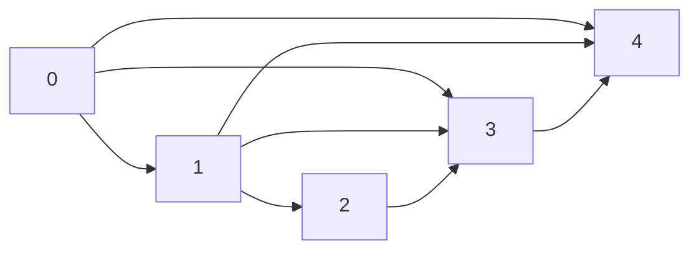

# 有向图 ==== 

# 逻辑结构 VS 树


图的逻辑结构：
```java

class Graph{
    int val;
    Graph[] neighbors;
}
```
咋一看，跟多节点数是一样的逻辑结构：
```java
class TreeNode{
    int val;
    TreeNode[] children;
}
```
递归遍历（DFS）和层级遍历（BFS）适用于图。

但实际上，我们不是上述的逻辑结构来实现这个树，而是使用**邻接表**和**邻接矩阵**来表示，为什么呢？
# 邻接表-prefer
```
[0]: [1,3,4]
[1]: [2,3,4]
[2]: [3]
[3]: [4]
```
```java
class Graph{
    List<Integer>[] graph;
    // or
    int[][] graph;
}
```
通过邻接表，我们可以快速查找某个节点的所有邻居，graph[x]表示x节点的所有邻居。
1. 优点：相比较邻接矩阵，占用空间更少
2. 缺点：判断两个节点相邻的事件复杂度不是O(1)，而是O(n)

# 邻接矩阵
```
  0  1  2  3  4
0
1
2
3
4
```
```java
class Graph{
    // matrix[x][y] 记录着x是否指向y的边。
    boolean[][] matrix;
}
```
通过邻接矩阵，我们也可以快速的查找某个节点的邻居：遍历matrix[x][0...y]，true即是x的邻居。
1. 优点：能够快速判断两个节点是否相邻：O(1)，matrix[x][y]==true表示x有指向y的边。
2. 缺点：相比较邻接表，占用空间更多。

# 度 出度 入度
无向图中：一个节点的边的总数，叫做度数(degree)
有向图中：度细分为**出度**和**入度**


# 加权
```java
class Graph{
    // 邻接表， 
    List<int[]>[] graph;
    //or
    int[][][] graph;

    // 邻接矩阵，将boolean替换为int，0表示无边，x(x>0)表示权重。
    int[][] matrix; 
}
```

邻接表：
```
[0]: [[1,2],[3,1],[4,4]] // 0 指向了1,3,4，权重分别是2,1,4
[1]: [2,3,4]
[2]: [3]
[3]: [4]
```

# 无向图
两个方向都有，即是无向图。
- 邻接表：添加上对应的元素即可。
- 邻接矩阵：matrix[x][y]=权重或者boolean，matrix[y][x]=权重或者boolean。

# 遍历 TODO 
2022年09月25日 这里需要跟【回溯算法】作比较才能更好的理解


## 框架
1. 这个遍历框架适用于有向图、无向图。
2. 如果带权重，则path add/remove的时候同样记录当前路径的权重即可。
3. 对比回溯算法的遍历。
4. **注意**，图中的每一个点都不一定都有链接，所以需要一个for循环将所有的点都带上。
5. **注意**，所谓遍历，就是每个点都只看一次，所以需要visited辅助数组。
6. **注意**，在回环检测中，traverse函数应该先判断回环，再设置visited, onPath
```java

public void graphTraverse(){
    for(int i = 0; i < cnt; i++){
        traverse(grapsh, i);
    }
}

boolean int[] visited;
boolean int[] onPath;
public void traverse(int[][] graph, int s){
    if(visited[s]) return;

    // visited
    visited[s] = ture;

    // path add
    for(int neighbor: graph[s]){
        traverse(graph, neighbor);
    }
    // path remove
}
```

注意，回溯算法的遍历的pathAdd，pathRemove是在for循环里做，而图的遍历在for循环之外做。
**他们的区别在于，在循环外做的话，也会记录整课数的根节点；循环内做的话，不会记录根节点信息。**
**其实不管是内还是外，都要保证每个节点都要被处理到。**
1. 上面的例子中，因为for循环里的是graph[0]的neighbor，所以在for之外先把graph[0]的情况加入到path，并进行判断，否则就漏掉了。
2. 下面的例子中，因为for循环里会把第一个元素也考虑进去，所以pathAdd/pathRemove可以放在循环里。
```java
result = [];

// “路径”和“选择列表”是必传的两个参数，当然还可以传更多的辅助参数，比如int[] nums，Boolean[]等
void backtrack(路径, 选择列表){
    if 满足结束条件:
        result.add(路径) // 将当前路径加入到结果集中。
        return; // 结束当前路径，要不要结束，取决于在这个路径之上再加入一些选择，还能不能构成有效解，
                // 比如在寻找所有的子集的时候，就不需要return。
                // 比如在寻找全排列的时候，因为找到一个排列之后，在这个路径之上已经没有备选项了，所有需要return。
    for 选择 in 选择列表：
        做选择 // 比如，加入路径更新选择列表
        backtrack(路径，选择列表)
        撤销选择 // 比如，移除路径并更新选择列表
}

```


# 无环图到达最后节点的路径
https://leetcode.cn/problems/all-paths-from-source-to-target/description/
给一个无环邻接表，找到从0开始到n的所有路径。
```java
private List<List<Integer>> rtn;
public List<List<Integer>> allPathSourceTarget(int[][] graph){
    LinkedList<Integer> path = new LinkedList<>();
    traverse(graph, 0, path);
    return rtn;
}

priate void traverse(int[][] graph, int s, LinkedList<Integer> path){
    path.addLast(s);
    if(s == graph.length){
        rtn.add(new LinkedList<>(path));
        path.removeLast();
        return;
    }

    for(int v: graph[s]){
        // v并不包括0这个点，所以path要放在路径for之外做。
        traverse(graph, v, paht);
    }

    path.removeLast();
}

```

# 岛屿问题
https://labuladong.gitee.io/algo/4/31/108/
- 二维数组的DFS遍历，其实本质是图的DFS，因为二维矩阵中的任意一个点，都有上下左右四个响铃节点。
- 不需要关系路径问题
```java
void dfs(int[][] grid, int i, int j, boolean[][] used){
    // base 
    if(i < 0 || j < 0 || i == grid.length || j == grid[0].length){
        return;
    }

    if(used[i][j]){
        return;
    }

    used[i][j] = true;
    dfs(grid, i - 1, j, used);
    dfs(grid, i + 1, j, used);
    dfs(grid, i, j - 1, used);
    dfs(grid, i, j + 1, used);
}
```

# 名流问题
https://labuladong.gitee.io/algo/di-yi-zhan-da78c/shou-ba-sh-03a72/zhong-li-x-ec564/#%E4%BC%98%E5%8C%96%E8%A7%A3%E6%B3%95
即在一个n节点的图（节点用0~n-1表示）中，是否有出度为0， 入度为n-1的节点

# 【环检测与拓扑排序】
# 环检测-DFS
https://labuladong.gitee.io/algo/di-yi-zhan-da78c/shou-ba-sh-03a72/huan-jian--e36de/
只要是依赖问题，就可以转为【有向图】环检测问题来处理。
- 依赖（有向）
- 是否可以完成?（是否有环）

1. 根据题目信息构建图
1. list<Integer>[] graph; 邻接表。-----一般都是邻接表用的比较多。
2. int[][] graph; 邻接矩阵。
```java
public List<Integer>[] bulidGraph(int nodeCnt, int[][] prerequisites){
    if(prerequisites == null || prerequisites.length == 0) return null;
    List<Integer>[] graph = new LinkedList<Integer>[codeCnt];
    for(int[] req: prerequisites){
        int from = req[1];
        int to = req[0];
        graph[from].add(to);
    }
    return graph;
}
```
2. 遍历图，通过onPath来判断是否有环
注意，以0为起点，不一定能够把整个图遍历完，因为有些图有可能是孤岛。
1. 在本场景中，visited用来记录已经遍历过，已经遍历过一次就需要再遍历了，毕竟结果（是否有环）都是一样的，其他场景比如只关注path的情况，可以不需要visited。
```java
public boolean canFinish(int numCourse, int[][] prerequsites){
    List<Integer>[] graph = buildGraph(numCourse, prerequsites);
    for(int node = 0; node < numCourse; node++){
        traverse(node, graph);
    }
}
```

3. 通过onPath来判断是否有环。
onPath可以是
1. boolean[]，只需要关注是否在当前路径上boolean[node]，不需要记录路径的顺序。
2. LinkedList<>，不仅需要关注是否在路径上list.contains(node)，还需要记录路径的顺序，比如返回具体的好环是什么。
```java
private boolean[] visited;
private boolean[] onPaht;
private boolean hasCycle;
private void traverse(int node, List<Integer>[] graph){
    if(onPath[node]){
        hasCycle = true;
        return;// 后续就不管了，不管有没有遍历完。
    }

    if(visited[node]){
        return;
    }

    visited[node] = true;
    onPath[node] = true;
    for(int neigbor: graph[node]){
        traverse(neigbor, graph);
    }
    onPath[node] = false;
}
```

4. 如何能找到闭环是哪个环？

 
# 环检测-BFS
我草，BFS才是真的无敌的存在。
先讲下原理吧。
1. 统计所有节点的入度int[] indegreee
2. 找到入度为0的节点，并把其放到队列中。
3. 辅助变量cnt，
4. 循环从队列中取节点。
   1. 每出队列一个元素，则cnt加1.
   2. 将该节点的邻接表的所有节点遍历一遍：
      1. 每个节点的入度都减1，如果减1之后的入度为0，则放到队列中。
5. 当队列中执行完毕之后，如果cnt不等于图中的节点数，那么则存在环，牛逼啊

# 拓扑排序-BFS
拓扑排序就是节点出栈的顺序。


# 【并查集算法】
```java
class UF {
    /* 将 p 和 q 连接 */
    public void union(int p, int q);
    /* 判断 p 和 q 是否连通 */
    public boolean connected(int p, int q);
    /* 返回图中有多少个连通分量 */
    public int count();
}
```
特性：
1、自反性：节点 p 和 p 是连通的。
2、对称性：如果节点 p 和 q 连通，那么 q 和 p 也连通。
3、传递性：如果节点 p 和 q 连通，q 和 r 连通，那么 p 和 r 也连通。

连通分量是什么？
比如有10个点，都不连通，那么连通分量就是10，
这个时候调用了union(0,1)，即把0，1连起来，那么联通分量就只有9了。
接着再调用union(1,2)，即把1，2连起来，那么连通分量就是8了。
接着再调用union(0,2)，即把0，2连起来，那么联通分量还是8。

1. UF新增构造器，参数n，整个图的节点数。
```java
public class UF{
    private int count;
    // parent[i]表示i节点的父节点。//TODO，为什么是父节点，而不是记录子节点？？
    private int[] parent;

    public UF(int n){
        this.count = n;
        // 每个节点的父节点默认都是自己，体现了【自反性】
        parent = new int[n];
        for(int i = 0; i < n; i++){
            parent[i] = i;
        }
    }
}
```

2. 如果union(p, q)，那么则让p或者q的【根节点】连接到另外一个的【根节点】上。
```java
public class UF{
    public void union(int p, int q){
        // 1. find the corresponding root node of p and q.
        int rootP = findRoot(p);
        int rootQ = findRoot(q);
        //what if it's linked already?? just return.
        if(rootP == rootQ) return;
        // 2. link anyone of them to another one.
        parent[rootP] = rootQ;
        // 3. count minus 1
        this.count--;
    }

    /**
     * TC is not that good.
     * */
    private int findRoot(int node){
        while(parent[node] != node){
            node = parent[node];
        }
        return node;
    }

    public int count(){
        return this.count;
    }
}
```

3. connect(p, q)，就是看p的根节点和q的根节点是不是同一个。
```java
public class UF{
    public boolean connect(int p , int q){
        int rootP = findRoot(p);
        int rootQ = findRoot(q);
        return rootP == rootQ;
    }
}
```

- UF是是一颗森林，里面有很多树（一棵树有1..x个节点），count表示这颗森林有多少棵树。
- 时间复杂度主要在findRoot函数中，最好是log1（N叉树），最差是N（退化为链表）。

## findRoot函数的平衡性优化。
避免树退化为链表：**尽量把小树挂在大树下**。每棵树需要记录其大小，优化如下：
To avoid the tree **degenerating** into a linked list: try to **attach** small trees under large ones. Each tree needs to record its size, and the optimization is as follows，make sure the time complexity is logN
```java
public UF{
    private int[] size;
    public UF(int n){
        ...
        // size[i]表示以为i为根节点的树有多少个节点。
        size = new int[n];
        for(int i = 0; i < n; i++){
            // make it default as 1.
            size[i] = 1;
        }
    }

    private int union(int q, int q){
        int rootP = findRoot(p);
        int rootQ = findRoot(q);
        if(size[rootP] < size(rootQ)){
            parent[rootP] = rootQ;
            size[rootQ] += size[rootP];
        }else{
            parent[rootQ] = rootP;
            size[rootP] += size[rootQ];
        }
        count--;
    }
}
```

## 进一步优化，变成size-1叉树
即，对于拥有size个节点的树而言，它的高度是2，是一个size-1叉树。是的findRoot的时间复杂度进一步将为O(1)；
for a tree with size nodes, it's height is 2, and it's a (size-1)-ary tree, the TC is **further reduced** to O(1), try to implement in the findRoot method.
```java
public class UF{
    // find the root and make all the node's parent is the root node.
    priate int findRoot(int node){
        while(parent[node] != node){
            // node's parent should the root, and how to find the root? use findRoot()
            parent[node] = findRoot(parent[node]);
        }
        // once the node's parent is the root, just return it's parent.
        return parent[node];
    }
}
```
thus, there is no need to do the balance work in union method.


# 并查集应用1： 等式可能性


# 并查集应用2： 以图判树
有n个节点，并且给一个一堆边信息如{{0,1},{0,2},{0,3},{1,4}}，判断这些变能够构成一个树。
1. 如果有循环，则不是树。
2. 如果有节点未能连接上，则不是树。
方法一：并查集
```java
public boolean validTree(int n, int[][] edges){
    UnionFind uf = new UnionFind(n);
    for(int[] edge: edges){
        int x = edge[0];
        int y = edge[1];
        if(uf.connected(x, y)){
            // if the x and y is already connected, then this edge will make a cycle.
            return false;
        }
        uf.union(x, y);
    }

    // make sure all the point is on the tree.
    return uf.count() == 1;
}
```

方法二：BFS
```java

```


# 【最小生成树Minimum Spanning Tree】mst
**在所有的可能的边中寻找若干个边，构成最小生成树**。这些边构成一棵树。

1. 树没有环，图可能有环。
2. 生成树是什么？就是能够包含图中所有节点的树（亦可以叫做无环连通子图）
3. 一个图可能会有多个生成树。
4. 对于加权图，如果最小生成树就是**权重最小的数**。
5. 一般来说，我们都是在无向加权图中计算最小生成树的，所以使用最小生成树算法的现实场景中，图的边权重一般代表成本、距离这样的标量。

Prim 算法（普里姆算法）和 Kruskal 算法（克鲁斯卡尔算法）两种
## Kruskal之最低成本联通所有城市
题目：最低成本联通所有城市
想象一下你是个城市基建规划者，地图上有 N 座城市，它们按以 1 到 N 的次序编号。
给你一些可连接的选项 conections，其中每个选项 conections[i] = [city1, city2, cost] 表示将城市 city1 和城市 city2 连接所要的成本。（连接是双向的，也就是说城市 city1 和城市 city2 相连也同样意味着城市 city2 和城市 city1 相连）。
返回使得每对城市间都存在将它们连接在一起的连通路径（可能长度为 1 的）最小成本。该最小成本应该是所用全部连接代价的综合。如果根据已知条件无法完成该项任务，则请你返回 -1。
```java
public int mininumCost(int n, int[][] connections){
    // 1. build edges, well, the connections is the edges we need.
    // 2. sort edge by weight asc
    Arrays.sort(connections, (a, b) -> a[2] - b[2]);

    // 3. UnionFind to connect all nodes if not connected yet, avoid cycle.
    UnionFind unionFind = new UnionFind(n);
    int totalCost = 0;
    for(int[] edges: connections){
        int cityA = edge[0];
        int cityB = edge[1];
        int cost = edge[2];
        // if cityA and cityB is already connected, directly connected or undirected connected.
        // then ignore this edge.
        if(unionFind.connected(cityA, cityB)){
            continue;
        }
        // else connect cityA and cityB and increase the total cost.
        unionFind.union(cityA, cityB);
        totalCost += cost;
    }

    // make sure all cities are connected(unionFind.count==1), else return -1 means that some cities aren't connected.
    return unionFind.count() == 1 ? totalCost : -1;
}
```

## Kruskal之连接所有点的最小费用。
给你一个points 数组，表示 2D 平面上的一些点，其中 points[i] = [xi, yi] 。
连接点 [xi, yi] 和点 [xj, yj] 的费用为它们之间的 曼哈顿距离 ：|xi - xj| + |yi - yj| ，其中 |val| 表示 val 的绝对值。
请你返回将所有点连接的最小总费用。只有任意两点之间 有且仅有 一条简单路径时，才认为所有点都已连接。
```java
public int minimumConnectionPoint(int[][] connections) {
        List<int[]> edges = new ArrayList<>();

        // 1. 构造出所有的边，及其曼哈顿距离 |Xi - Xj| + |Yi - Yj|
        for (int i = 0; i < connections.length; i++) {
            for (int j = i + 1; j < connections.length; j++) {
                int ix = connections[i][0];
                int iy = connections[i][1];
                int jx = connections[j][0];
                int jy = connections[j][1];
                edges.add(new int[]{i, j, Math.abs(ix - jx) + Math.abs(iy - jy)});
            }
        }

        // 2. 排序，从小到大，保证第3步中的【生成树】是【最小生成树】
        edges.sort(Comparator.comparingInt(a -> a[2]));

        // 3. 通过并查集找到生成树。
        UnionFind unionFind = new UnionFind(edges.size());
        int total = 0;
        for(int i = 0; i < edges.size(); i++){
            int a = edges.get(i)[0];
            int b = edges.get(i)[1];
            int w = edges.get(i)[2];
            if(unionFind.connected(a, b)) continue;
            unionFind.union(a, b);
            total+=w;
        }
        // 4. 这里不需要判断count，因为我们构建出来的edge，肯定可以连接上所有的点。
        return total;
    }
```

## Prim
https://labuladong.online/algo/di-yi-zhan-da78c/shou-ba-sh-03a72/prim-zui-x-0ef51/


# 【狄克斯特拉Dijkstra】


# ----图的其他问题
# 最短的桥
# 最大人工岛
# 二进制矩阵中的特殊位置
# 二维网格迁移
# 变为棋盘
# 奇数值单元格的数目